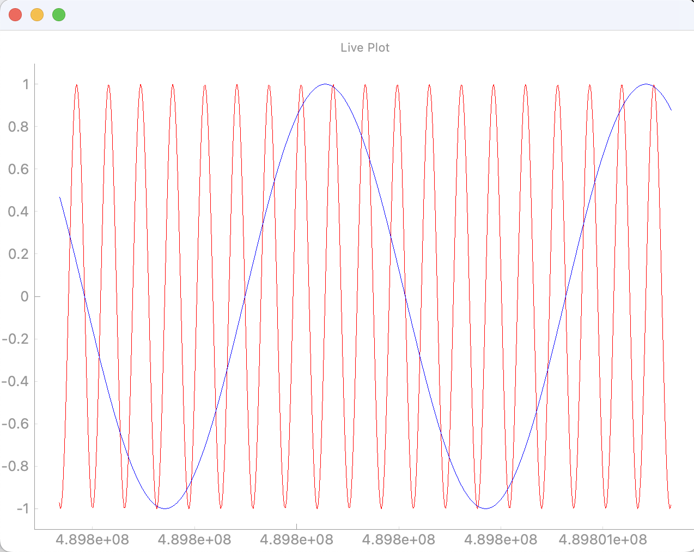

# pglive_SAMPLE
- pgliveを使用したサンプルプログラムのリポジトリ
- UDPでデータを受け取り，リアルタイムプロットを行う
## [pglive](https://github.com/domarm-comat/pglive)
- pyqtgraphでリアルタイムプロットを簡単に作成できるライブラリ
- PyQt5, PyQt6, PySide2, PySide6に対応
## Usage
```
pip install pglive
pip install PyQt6
```
- pgliveは3.8〜3.10のPythonを推奨
## Description
- pgqtgraphはPyQtがベース
    - PyQtの構成と同じ
- グラフを並べたい時は，Widgetを作る
- グラフを重ねたい時は，Plotを作る

## Graph View
- live_plot.py

- live_plot_overlap.py

- live_plot_multiple.py

